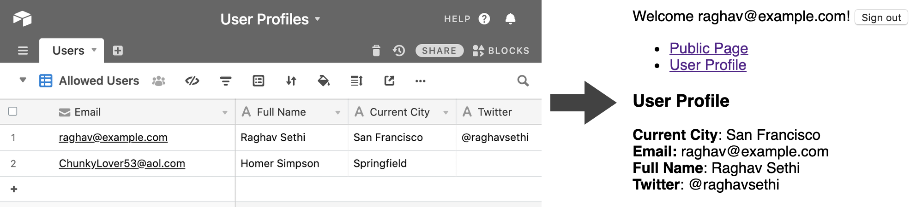

Netlify identity with Airtable
==============================



This is an example project that shows how to set up a simple authenticated single page app where user information is
stored in Airtable. It uses the [Netlify Identity Widget](https://github.com/netlify/netlify-identity-widget) along with
serverless functions to control user registration and login.

In this example, a single table in Airtable stores user profile information, including email addresses. Only users that
exist in this table are allowed to register or log in. Users can only see their own profile information. The Netlify 
identity user object is populated with the user profile information from Airtable on login and validation, and is
therefore easily accessible from the client side Javascript.

Usage
-----

The example is configured by setting the following environment variables:

* `AIRTABLE_API_KEY` - Airtable API key here (https://airtable.com/account)
* `AIRTABLE_BASE_ID` - Airtable base ID, eg: appZ6PIv6FNBGtFeB
* `AIRTABLE_PRIMARY_TABLE_NAME` - The table name that stores profile information. The table must have a field called
'Email'
* `AIRTABLE_PRIMARY_TABLE_VIEW_NAME` (optional) - To restrict the set of allowed users, you can specify a view. Only 
user records visible in the view will be allowed to register or log in.

### Deploying

[](https://app.netlify.com/start/deploy?repository=https://github.com/raghavsethi/react-netlify-identity-airtable)

After the initial deploy is complete, turn on Netlify Identity in app settings and trigger another deploy.

### Developing locally

```shell script
yarn install
yarn start
```

You will be prompted for a deployed Netlify site with Identity enabled when running the development server. To iterate 
on functions locally, you may need to use [Netlify Dev](https://docs.netlify.com/cli/get-started/#netlify-dev).

This repository is based on the React [example](https://github.com/netlify/netlify-identity-widget/tree/master/example/react)
from the Netlify Identity Widget.
